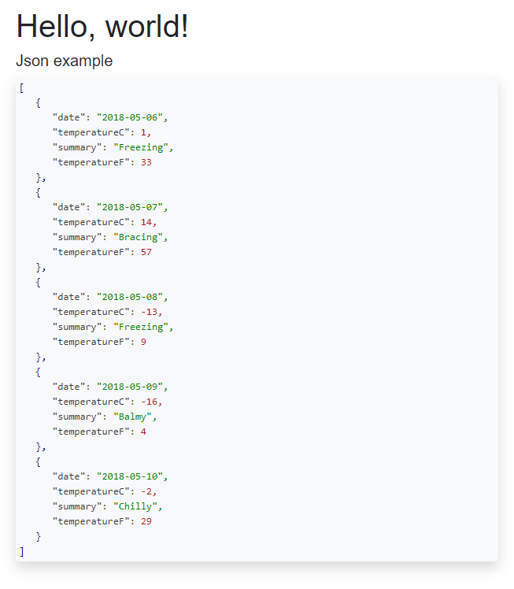

# Introduction 
I tried to use various highlighting solutions in a Blazor Client app without success.  
BlazorTools provides a very lightweight component CodeBlock that formats and highlights code files. 
At the moment, only Json code is supported. 

# Getting Started

1. Add the Proliminal.BlazorTools NuGet package.

2. Add a `CodeBlock` component to your Blazor page:

    `<CodeBlock Code=@forecasts></CodeBlock>`  

    Where `forecasts` is a local string variable with a serialized json object.

3. In `index.html` add a link to the stylesheet (omit if you create your own styles):

    `<link href="_content/Proliminal.BlazorTools/blazortools-styles.css" rel="stylesheet" />`

4. In `index.html` add a link to the javascript file that contains interop functions:

    ``

Run and enjoy:

# Dependencies

None.

# Contribute
I've not planned anything long-term for this. I'm just serving an immediate need. It's possible that I will add support for other languages (XML first), unless I find another lightweight solution that works inside Blazor Client side pages.

That said, contributions are welcome.
