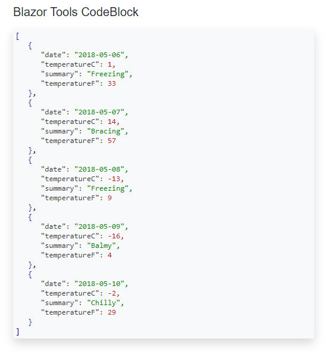
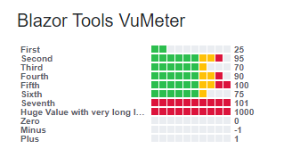

# Introduction 

I tried to use various Javascript based code syntax highlighting libraries in a Blazor Client app without success.  

BlazorTools provides a very lightweight component <strong>CodeBlock</strong> that formats and highlights code. (For now, only Json is supported.)

I also needed a VU meter to show the length of queues, so I created <strong>VuMeter</strong>. 


# Getting Started

1. Add the Proliminal.BlazorTools NuGet package.


3. In `index.html` add a link to the stylesheet (omit if you create your own styles):

    ```
    <link href="_content/Proliminal.BlazorTools/blazortools-styles.css" rel="stylesheet" />
    ```

4. In `index.html` add a link to the javascript file that contains interop functions:

    ```
    <script src="_content/Proliminal.BlazorTools/blazortools.js"></script>
    ```

## Json Highlighting

1. Add a `using` statement to your page or to _Imports.razor:

    ```
    @using Proliminal.BlazorTools
    ```

2. Add a `CodeBlock` component to your page:  

    ```
    <CodeBlock Code="@forecasts"></CodeBlock>
    ``` 

    Where `forecasts` is a string containing a serialized json object.


Run and enjoy:



## VuMeter

1. Add a `using` statement to your page or to _Imports.razor:

    ```
    @using Proliminal.BlazorTools
    ```

2. Add a `VuMeter` component to your page:

    ```
    <VuMeter Label="First" Value="25" MaxValue="100"></VuMeter>
    ```

VuMeters showing label sizes and values:



---
# Dependencies


None.


# Contribute
I've not planned anything long-term for this. I'm just serving an immediate need. It's possible that I will add support for other languages (XML first), unless I find another lightweight solution that works inside Blazor Client side pages.

That said, contributions are welcome.
